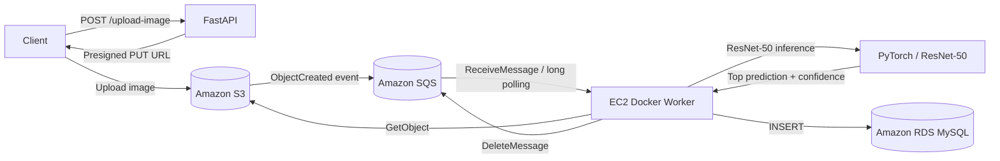

# AWS Image Classification Pipeline

An asynchronous, event-driven image classification pipeline built with **FastAPI**, **Amazon S3**, **Amazon SQS**, **Amazon EC2**, **Docker**, **PyTorch (ResNet-50)**, and **Amazon RDS (MySQL)**.

This project demonstrates how an uploaded image flows through a cloud-native workflow: the API issues a presigned S3 upload URL, S3 emits an event to SQS on upload, a Dockerized EC2 worker polls the queue and runs ResNet-50 inference, and the top prediction is persisted to MySQL.

> **Note:** The model uses the pretrained `ResNet50_Weights.DEFAULT` ImageNet-1K weights. The sample images are dogs, but the underlying model is a general-purpose ImageNet classifier, not a dog-breed-specific model.

---

## Table of Contents

- [Architecture](#architecture)
- [End-to-End Flow](#end-to-end-flow)
- [Key Features](#key-features)
- [Tech Stack](#tech-stack)
- [Project Structure](#project-structure)
- [Getting Started](#getting-started)
- [API Reference](#api-reference)
- [Machine Learning Details](#machine-learning-details)
- [Worker](#worker)
- [Database](#database)
- [Environment Variables](#environment-variables)
- [AWS Configuration](#aws-configuration)
- [Testing the Complete Pipeline](#testing-the-complete-pipeline)
- [Error Handling](#error-handling)
- [Future Improvements](#future-improvements)
- [Skills Demonstrated](#skills-demonstrated)

---

## Architecture



## End-to-End Flow

1. The client requests an upload URL from FastAPI.
2. FastAPI generates a presigned S3 PUT URL.
3. The client uploads the image directly to S3.
4. S3 emits an `ObjectCreated` event to SQS.
5. The EC2 Docker worker long-polls SQS for new messages.
6. The worker extracts the S3 bucket and object key from the event.
7. The worker downloads the image from S3.
8. ResNet-50 performs inference using the official torchvision preprocessing and ImageNet-1K labels.
9. The worker saves the top prediction and confidence score to RDS MySQL.
10. After successful processing, the worker deletes the SQS message.

## Key Features

- **Presigned S3 uploads** — images are uploaded directly to S3, bypassing the API server.
- **Event-driven processing** — an S3 upload automatically triggers an SQS message.
- **Asynchronous worker architecture** — the API is decoupled from ML inference.
- **Containerized inference** — the worker runs as a Docker container on EC2.
- **Pretrained deep-learning model** — uses PyTorch and torchvision's pretrained ResNet-50.
- **Persistent results** — predictions are stored in Amazon RDS MySQL.
- **Long polling** — the worker uses SQS long polling (`WaitTimeSeconds=20`) to reduce cost and latency.
- **IAM-based AWS access** — the EC2 worker uses its attached IAM role instead of hardcoded credentials.

## Tech Stack

| Technology         | Purpose                              |
|--------------------|---------------------------------------|
| Python             | Application and worker code           |
| FastAPI            | REST API                              |
| Boto3              | AWS SDK for Python                    |
| Amazon S3          | Image storage                         |
| Amazon SQS         | Asynchronous message queue            |
| Amazon EC2         | Compute for the worker                |
| Docker             | Worker containerization               |
| PyTorch            | ML inference                          |
| torchvision        | ResNet-50 model and preprocessing     |
| Amazon RDS / MySQL | Prediction storage                    |
| Pillow             | Image loading and conversion          |

## Project Structure

```
.
├── main.py                  # FastAPI application
├── predict_dog_breed.py     # Local/model inference and CLI
├── worker.py                # SQS worker, S3 download, inference, RDS storage
├── Dockerfile               # Container image for the EC2 worker
├── requirements.txt         # Python dependencies
└── images/
    ├── husky.jpg
    └── golden_retriver.avif
```

> **Note:** AWS infrastructure configuration (S3, SQS, RDS, IAM) is not included in this repository and must be provisioned separately.

## Getting Started

### Prerequisites

- Python 3.11+
- An AWS account with S3, SQS, EC2, and RDS access
- Docker (for running the worker in a container)

### Installation

```bash
pip install -r requirements.txt
```

### Run the API

```bash
uvicorn main:app --reload
```

The API will be available at `http://127.0.0.1:8000`, with interactive documentation at `http://127.0.0.1:8000/docs`.

### Run the Worker with Docker

The worker is containerized via the included `Dockerfile`, based on `python:3.11-slim`:

```dockerfile
FROM python:3.11-slim

WORKDIR /app

# Copy requirement files first to leverage Docker layer caching
COPY requirements.txt .

# Install Python dependencies
RUN pip install --no-cache-dir -r requirements.txt

# Copy application files into the container
COPY . .

# Expose the port FastAPI runs on
EXPOSE 8000

# Command to launch the server
# CMD ["uvicorn", "main:app", "--host", "0.0.0.0", "--port", "8000"]
CMD ["python", "-u", "worker.py"]
```

By default, the container's entrypoint runs `worker.py`, so this image is intended to be built and deployed as the **EC2 Docker worker** described in the [Architecture](#architecture) section above. Port `8000` is exposed for convenience if you swap the `CMD` to run the FastAPI app instead (the commented-out `uvicorn` line).

Build and run the worker image:

```bash
docker build -t dog-worker .
docker run -d \
  --name dog-worker \
  -e DB_HOST=<your-rds-endpoint> \
  -e DB_PORT=3306 \
  -e DB_NAME=dog_classifier \
  -e DB_USER=admin \
  -e DB_PASSWORD=<your-db-password> \
  dog-worker
```

> On EC2, prefer an attached IAM role over static AWS credentials so the container can access S3 and SQS without hardcoded keys (see [AWS Configuration](#aws-configuration)).

### Run a Local Prediction (CLI)

```bash
python predict_dog_breed.py --image images/husky.jpg --top_k 3
```

This prints the top predictions and their confidence values.

## API Reference

### Health Check

```
GET /
```

**Response:**

```json
{
  "message": "API is running!"
}
```

### Generate an S3 Upload URL

```
POST /upload-image?object_name=husky.jpg
```

**Response:**

```json
{
  "upload_url": "<presigned S3 URL>",
  "object_name": "husky.jpg"
}
```

The presigned URL is valid for **300 seconds**. The client uploads the image directly to S3:

```bash
curl --upload-file "images/husky.jpg" "<PRESIGNED_URL>"
```

### Run a Prediction Directly

```
POST /run-prediction
```

**Request body:**

```json
{
  "image_path": "images/husky.jpg",
  "top_k": 3
}
```

> `image_path` must refer to a file accessible to the machine running the API.

## Machine Learning Details

The project loads the pretrained ResNet-50 model and its default weights:

```python
weights = models.ResNet50_Weights.DEFAULT
model = models.resnet50(weights=weights)
model.eval()
```

Preprocessing is derived directly from the selected torchvision weights, ensuring consistency with how the model was trained:

```python
preprocess = weights.transforms()
```

Inference runs without gradient tracking for efficiency:

```python
with torch.no_grad():
    output = model(input_batch)
```

The worker then applies softmax and selects the top three ImageNet-1K predictions. Only the top prediction and its confidence are currently persisted to the database.

## Worker

`worker.py` handles the asynchronous processing stage of the pipeline. It:

1. Connects to SQS and long-polls the queue (`WaitTimeSeconds=20`).
2. Receives an S3 event message.
3. Extracts the S3 bucket and object key.
4. Downloads the image from S3.
5. Runs ResNet-50 inference.
6. Connects to RDS MySQL and creates the `predictions` table if it doesn't already exist.
7. Inserts the top prediction.
8. Deletes the processed SQS message.

## Database

The worker automatically creates the following table:

```sql
CREATE TABLE IF NOT EXISTS predictions (
    id INT AUTO_INCREMENT PRIMARY KEY,
    image_key VARCHAR(500) NOT NULL,
    predicted_label VARCHAR(255) NOT NULL,
    confidence FLOAT NOT NULL,
    timestamp TIMESTAMP DEFAULT CURRENT_TIMESTAMP
);
```

**Example query:**

```sql
SELECT *
FROM predictions
ORDER BY timestamp DESC
LIMIT 5;
```

## Environment Variables

The worker expects the following database configuration variables:

| Variable      | Default          | Description            |
|---------------|------------------|-------------------------|
| `DB_HOST`     | —                | RDS MySQL host          |
| `DB_PORT`     | `3306`           | RDS MySQL port          |
| `DB_NAME`     | `dog_classifier` | Database name           |
| `DB_USER`     | `admin`          | Database username       |
| `DB_PASSWORD` | —                | Database password       |

> **Security:** Never commit database credentials or other secrets to source control. Use environment variables, AWS Secrets Manager, or a `.env` file excluded via `.gitignore`.

## AWS Configuration

The worker is currently configured for:

- **Region:** `us-east-1`
- **S3 bucket:** `dog-img-bucket1`
- **SQS queue:** `dog-image-processing`

For deployment, attach an IAM role to the EC2 instance scoped to only the permissions the worker needs — namely access to the relevant S3 objects and the SQS queue. Avoid embedding long-lived AWS access keys in source code or Docker images.

## Testing the Complete Pipeline

A successful end-to-end test follows this sequence:

```
Client → FastAPI → Presigned S3 URL → S3 → ObjectCreated event → SQS
       → EC2 Docker worker → S3 image download → ResNet-50 inference → RDS MySQL
```

1. **Build and run the worker on EC2**

   ```bash
   docker build -t dog-worker .
   docker run -d --name dog-worker \
     -e DB_HOST=<your-rds-endpoint> \
     -e DB_PORT=3306 \
     -e DB_NAME=dog_classifier \
     -e DB_USER=admin \
     -e DB_PASSWORD=<your-db-password> \
     dog-worker

   docker ps
   docker logs -f dog-worker
   ```

2. **Request an upload URL**

   ```bash
   curl -X POST "http://127.0.0.1:8000/upload-image?object_name=test-dog.jpg"
   ```

3. **Upload the image**

   ```bash
   curl --upload-file "images/husky.jpg" "<PRESIGNED_URL>"
   ```

4. **Verify the object landed in S3**

   ```bash
   aws s3 ls s3://dog-img-bucket1/
   ```

5. **Verify the worker processed it**

   The Docker logs should show the SQS message being received, the S3 object being downloaded, inference running, and the prediction being saved.

6. **Verify the result in MySQL**

   ```sql
   SELECT *
   FROM predictions
   ORDER BY timestamp DESC
   LIMIT 5;
   ```

   If a new row appears for the uploaded image, the pipeline succeeded end to end.

## Error Handling

The worker currently wraps message processing in a broad exception handler:

```python
try:
    process_message(message)
except Exception as e:
    print(f"Error processing message: {e}")
```

A recommended production improvement is adding an **SQS Dead Letter Queue (DLQ)** with explicit retry handling, so repeatedly failing messages are isolated instead of retrying indefinitely.

## Future Improvements

- Add an SQS Dead Letter Queue (DLQ)
- Add configurable SQS visibility timeout and retry behavior
- Add structured logging and CloudWatch monitoring
- Add automated tests for the API, worker, and inference logic
- Pin and document production Docker image dependencies
- Separate API and worker dependency requirements
- Store top-k predictions instead of only the top prediction
- Add prediction/request IDs for tracing an image through the pipeline
- Add authentication/authorization to the API
- Add CI/CD for automated testing and Docker image deployment
- Explore an autoscaling worker architecture for higher traffic

## Skills Demonstrated

This project demonstrates practical, hands-on experience with:

- REST API development
- Cloud object storage
- Event-driven architecture
- Message queues and asynchronous processing
- Docker containerization
- EC2 deployment
- IAM permissions and least-privilege access
- Deep-learning inference
- Relational database integration
- End-to-end cloud system debugging
